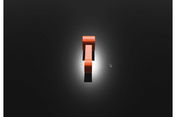

# rust-lightbike- creating a 3D game with rust and bevy

My next 3D game with rust(https://www.rust-lang.org) and the bevy framework(https://bevyengine.org) using Rapier https://github.com/dimforge/bevy_rapier learning more about shaders.

## 1. Step _ simple bike and arena

<br><br><br><br><br><br><br><br><br><br><br><br><br><br>

## 2. Step _ control bike and camera

<br><br><br><br><br><br><br><br><br><br><br><br><br><br>


```Rust

```
